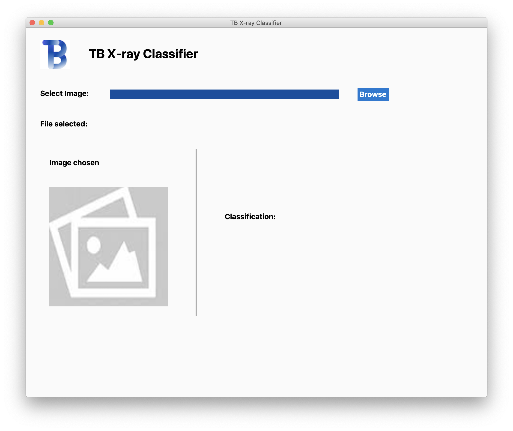
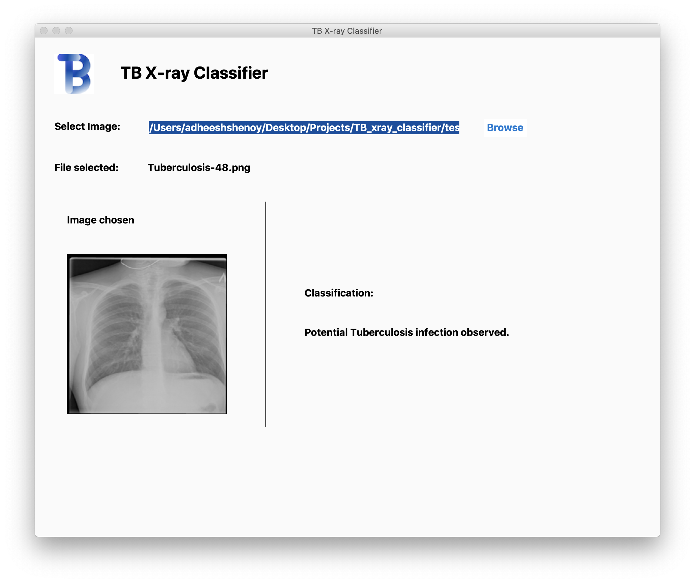
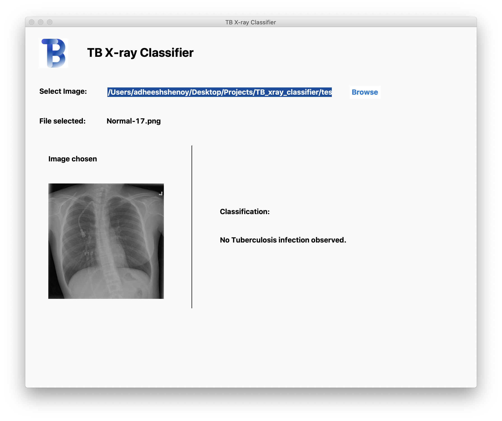
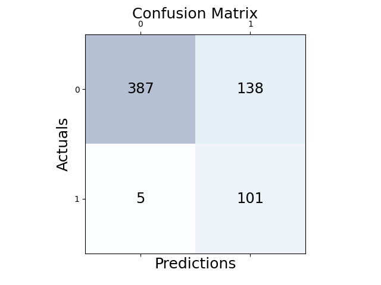
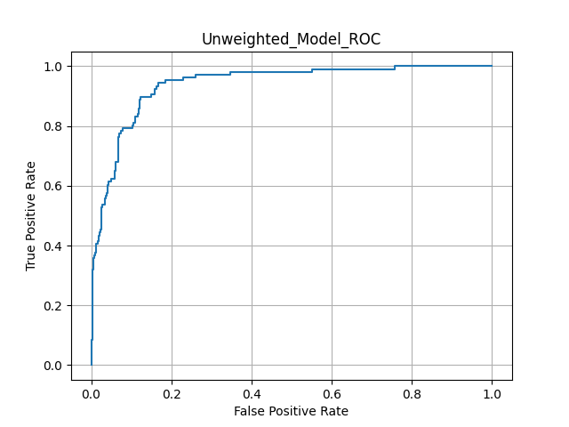
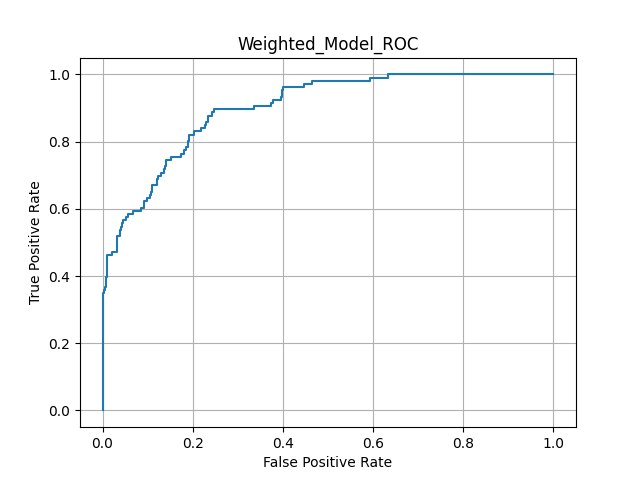

# TB X-Ray Classifier

This project aims to investigate if X-ray images can be used to classify whether a patient suffers from Tuberculosis (TB). 

In order to make this a complete project, I worked on the Deep Learning model as well as attempted to build a pc/mac application where the user is able to select an image and receive a classification for that image.

For those interested, I shall report each stage of the model development process and the reasoning behind the choice of model and the addition of layers/methods to improve the overall results. 

# Demo-Preview





# Table of contents

- [Installation](#installation)
- [Usage](#usage)
- [Development](#development)
- [Conclusion](#conclusion)

# Installation
[(Back to top)](#table-of-contents)

Before installation make sure you have python3 set up on the computer. This project was built using python version 3.7

Follow the following steps for installation:

1. Download this repository using ```git clone <repository>``` or downloading the zip file.
2. Download all the dependencies using the following command:

```
pip3 install -r requirements.txt
or 
pip install -r requirements.txt
```

# Usage
[(Back to top)](#table-of-contents)

There are two ways to download the application. In both situations it is assumed that the python3 has been installed on the computer.  

1. The "easy" method: 
- Change directory into the app directory
- Run the command ```python3 app.py```
2. The "hard" method: 
- Change directory into the app directory
- Run command ```pyinstaller app.spec```
- Two folders shall be created, build and dist. The dist folder should contain an executable for you to run the app.

# Development
[(Back to top)](#table-of-contents)

## TL;DR
- Trained a classifier to detect TB cases using X-ray images
- Set computational resource limitation, False Negative limitation and Model space limitation (<=20mb) for development
- Utilized pre-trained MobileNetV2 as backbone architecture
- Investigated layers/methods such as:
    - Data Augmentation
    - Class Weights
    - Batch Normalization Layers
    - Dropout Layers
    - Weighted Binary Cross Entropy
    - Ensemble voting
- Developed a model with a very low false negative rate. 
- Created a MacOS application to use the models

## Project Criteria

The limitations I set for this project were as follows:
- I should be able to train and develop the model entirely on my computer without the help of external resources such as Google colab or AWS.
- The number of false negatives should be as small as possible since in the medical field, a false negative test could be deemed lethal. 
- The size of the entire model cannot exceed 20 mb. 

My current system is a Macbook Pro with 16GB RAM, with an intel i5 CPU and integrated GPU. This setup, constrained my possible approaches and forced me to think creatively as any large model would lead to extremely long training times. Therefore, I chose to use a pre-trained model, in particular, MobileNet v2 from the tensorflow library and used other methods to squeeze the best results. 

## Data Description

The dataset used for this project was taken from https://www.kaggle.com/datasets/tawsifurrahman/tuberculosis-tb-chest-xray-dataset. I tried to gain access to the complete dataset from NIAID, however, I was unsuccessful as this is a personal project. Nonetheless, the complete dataset used for this project contains 3500 (Normal) + 700 (TB) = 4200 X-ray images.

These images varied in color, zoom and contrast and contained white patches to possibly protect the information about the patient. This made the dataset particularly diverse. 

During training, each image was rescaled from [0, 255] to [0, 1]. To provide additional diversity within the dataset, data augmentation methods were applied on each image. The following augmentations were applied:
- Horizontal flip -> In case of a left, right flip when scanning the X-ray
- Contrast -> For different X-ray quality
- Brightness -> For different X-ray quality
- Rotation -> In case of a shift while scanning the X-ray
- Vertical flip -> In case the image was not rotated with the correct side up
- Zoom -> In case the X-ray was targeted.

For training, testing and validation, the dataset was divided with a 70, 15, 15 split. 

## Training

As mentioned above, I used the pre-trained MobileNetV2 model from the tensorflow library. This model was trained on the ImageNet dataset. Although not ideal, since the ImageNet dataset does not contain any X-ray or medical images, I assumed that the pre-trained model had adequate feature extraction capabilities for this task.  

For transfer learning, the layers from the MobileNet model were frozen and only the dense layers were trained. A total of 5 dense layers were added with a total of 512, 128, 32, 8, 1 units. The last layer used the sigmoid activation function, whereas the rest used the ReLU activation function.

For every model trained, unless mentioned otherwise, the default Adam optimizer was used using the magical learning rate of 3e-4. To prevent overfitting and save the best model based on the validation loss, the Early stopping callback and the Model Checkpoint callback provided by the tensorflow library were used.  

### Model 0
#### Image size: 256 | loss: Binary cross entropy | Threshold: 0.5 | Training time/epoch: 293s

A particular article I read by Andrey Karpathy at Tesla, mentioned that the first step of developing a model is to overfit it. The reasoning behind this was to make sure that the model can learn and that there are no bugs in the training method. Therefore, for the first step, I directly plugged all the data into the pre-trained model and trained the last 4 dense layers.

Training Accuracy: 98.07%
Validation results: 
- Accuracy: 83.2%
- Confusion matrix:
[525   0]
[106   0]

### Model 1
#### Image size: 256 | loss: Binary cross entropy | Threshold: 0.5 | Training time/epoch: 290s

Based on the results, clearly the imbalance in the dataset is causing the lack of any positive predictions. One method to fix this is using the class_weight attribute in the fit function. This attribute penalizes mispredictions of the minority class more than the majority class. The weights of the class can be calculated as 
```total sample / (# of classes * number of samples in class i)```. A model trained with the class weights attribute had the following results:

Training Accuracy: 98.38%
Validation Results:
- Accuracy: 83.84%
- Confusion Matrix:
[525   0]
[102   4]

### Model 2
#### Image size: 256 | loss: Binary cross entropy | Threshold: 0.5 | Training time/epoch: 341s

Although Model 1 improved the results for the minor class slightly, the model still seems to overfit to the training set. A good option to prevent this is to use regularization methods such as Dropout layers and Batch normalization layers. Therefore, after each dense layer, a BatchNormalization layer + Activation layer + Dropout layer were added. Model trained using these additions had the following results: 

Training Accuracy: 97.52%
Validation Results:
- Accuracy: 83.20%
- Confusion Matrix: 
[525   0]
[106   0]

### Model 3
#### Image size: 256 | loss: Binary cross entropy | Threshold: 0.5 | Training time/epoch: 482s

The changes so far did not make much difference to false negatives. Another approach to tackle this would be to augment the minority class to make the dataset balanced. Therefore, for every batch, there would be approximately equal number of samples for each class. Although, this would increase the training time as there are more batches, it should reduce the number of false negatives. The model trained on this had the following results: 

Training Accuracy: 91.06%
Validation Results:
- Accuracy: 93.18%
- Confusion Matrix: 
[524   1]
[42   64]

### Model 4
#### Image size: 128 | loss: Binary cross entropy | Threshold: 0.5 | Training time/epoch: 119s and 192s 

Increasing the number of samples of the minority class and balancing the dataset drastically improved the results. At this point, the time for training had almost doubled. Therefore, small images may help reduce the training time and reduce the computational complexity. I tried the image size of 64 x 64 and 128 x 128. The models trained on this had the following results: 

##### Image Size: 64

Training Accuracy: 78.45%
Validation Results:
- Accuracy: 84.79%
- Confusion Matrix: 
[514  11]
[ 85  21]

##### Image Size: 128
Training Accuracy: 75.76%
Validation Results:
- Accuracy: 90.17%
- Confusion Matrix: 
[511  14]
[ 48  58]

### Model 5
#### Image size: 128 | loss: Weighted Binary cross entropy | Threshold: 0.5 | Training time/epoch: 182s

The 128 x 128 images seem like a sweet spot for this classification problem. However, the model still has multiple false negatives. Therefore, to tackle this, we can use a weighted binary cross entropy. If the weight > 1, the number of false negatives are reduced. Therefore, I trained 3 models with weights of 1.5, 2 and 2.5. The results of models trained with this modification are as followed: 

##### Weight 1.5
Training Accuracy: 85.85%
Validation Results:
- Accuracy: 89.54%
- Confusion Matrix: 
[514  11]
[ 55  51]

##### Weight 2.0
Training Accuracy: 86.75%
Validation Results:
- Accuracy: 89.86%
- Confusion Matrix: 
[511  14]
[ 41  64]

##### Weight 2.5
Training Accuracy: 80.48%
Validation Results:
- Accuracy: 87.16%
- Confusion Matrix: 
[518   7]
[ 74   32]

### Top Model comparison

With the lack of better ideas, the final contenders for the models were Model 4 with 128 x 128 image size + binary cross entropy loss function and model 5 with a weighted binary cross entropy loss function of 2. For each model, I utilized the ROC curve plotted using the validation dataset to compute the best threshold to use. This is done by plotting the ROC curve and finding the threshold value that gives the left most point of the curve or the threshold value where the true positive rate is equal to the true negative rate. This can be easily computed using the roc_curve function from sklearn. The results for both the models tested on the test dataset are below:

#### Unweighted loss Model
Threshold used: 0.44772145

Validation results
- Accuracy: 88.11%
- Confusion Matrix:
[462  63]
[ 12  94]



Test results
- Accuracy: 86.98
- Confusion Matrix:
[462  63]
[ 19  86]

#### Weighted loss Model
Threshold used: 0.44156814

Validation results
- Accuracy: 80.67%
- Confusion Matrix:
[424 101]
[ 21  85]



Test results
- Accuracy: 81.43%
- Confusion Matrix:
[428  97]
[ 20  85]

## Final model

Since the final results of the weighted and unweighted loss models were comparable, yet the number of false negatives were still fairly high, a final approach would be to use a voting algorithm between the two models. Therefore, if either of the models predicted positive, the prediction would be considered a positive. 

```
Let i and j be the prediction from model_1 and model_2

{
    if i == 1 or j == 1: return 1
    else: return 0
}
```
The results from this model were promising. With a larger cost on the overall accuracy of the model,
only 4% of the Positive cases were classified as negative. 

Test Results:
- Accuracy: 77.34%

- 

- Precision: 
    - 0: 0.99
    - 1: 0.42

- Recall:
    - 0.74
    - 0.95

# Conclusion
[(Back to top)](#table-of-contents)

Overall this was an interesting project to work on. The lack of data and the added constraints made it difficult to develop a good model. I am sure using state of the art architectures such as ViT or even training the entire model from scratch would drastically improve the results. However, I am proud of the overall accuracy of the model and especially proud of the small number of false negative cases. If anyone has any additional ideas, or thoughts on the work, feel free to reach out! Thank you!